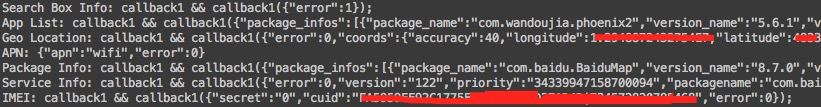

# Baidu-WormHole-Test

百度 WormHole 漏洞（or 后门，笑）测试程序，删除了 `sendintent`、`addcontactinfo`、`uploadfile`、`downloadfile` 等危险操作。

对校园网的部分网段做了下扫描，发现目前（11/05）还有不小比例的 Android 设备开放了 6259 和 40310 端口，然而并非所有设备都有 WormHole 漏洞：少数设备能够获取全部信息，部分设备仅能获取 CUID 信息，其他设备啥也拿不到。原因懒得分析了。